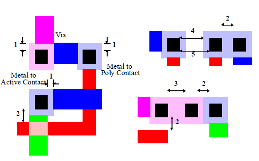

Physical layout design is a crucial step in the fabrication of integrated circuits (ICs). It involves translating a circuit schematic into geometric patterns that define the placement and interconnection of devices on silicon. Proper layout design ensures manufacturability, reliability, and optimal use of silicon area.

### Importance of Layout Design Rules

Every circuit layout must conform to a set of geometric constraints known as layout design rules. These rules specify minimum feature sizes, line widths, and separations for on-chip structures such as metal and polysilicon interconnects, diffusion areas, and contacts. Violating these rules can result in open circuits, short circuits, or reduced yield during manufacturing. Adhering to layout design rules significantly increases the probability of fabricating a successful product with high yield.

### Types of Layout Design Rules

Layout design rules are usually described in two ways:

#### Micron Rules

Micron rules specify layout constraints such as minimum feature sizes and separations in terms of absolute dimensions (micrometers, μm). These rules are technology-dependent and must be updated for each process node.

#### Lambda Rules

Lambda rules specify layout constraints in terms of a single scalable parameter, λ (lambda). All geometrical constraints are expressed as integer multiples of λ, allowing easy proportional scaling across different technology nodes. Lambda rules simplify design portability and understanding.

### Common Lambda-Based Design Rules (L-Rules)

| Description                                  | Value |
| -------------------------------------------- | ----- |
| Minimum active area width                    | 3λ    |
| Minimum active area spacing                  | 3λ    |
| Minimum poly width                           | 2λ    |
| Minimum poly spacing                         | 2λ    |
| Minimum gate extension of poly over active   | 2λ    |
| Minimum poly-active edge spacing (outside)   | 1λ    |
| Minimum poly-active edge spacing (inside)    | 3λ    |
| Minimum metal width                          | 3λ    |
| Minimum metal spacing                        | 3λ    |
| Poly contact size                            | 2λ    |
| Minimum poly contact spacing                 | 2λ    |
| Minimum poly contact to poly edge spacing    | 1λ    |
| Minimum poly contact to metal edge spacing   | 1λ    |
| Minimum poly contact to active edge spacing  | 3λ    |
| Active contact size                          | 2λ    |
| Minimum active contact spacing (same region) | 2λ    |
| Minimum active contact to active edge        | 1λ    |
| Minimum active contact to metal edge         | 1λ    |
| Minimum active contact to poly edge          | 3λ    |
| Minimum active contact spacing               | 6λ    |

### Visual Examples of Layout Design Rules

**Figure 1:** Intra Layer Design Rules

**Figure 2:** Transistor Layout

**Figure 3:** Vias and Contacts

**Figure 4:** CMOS Inverter Layout
