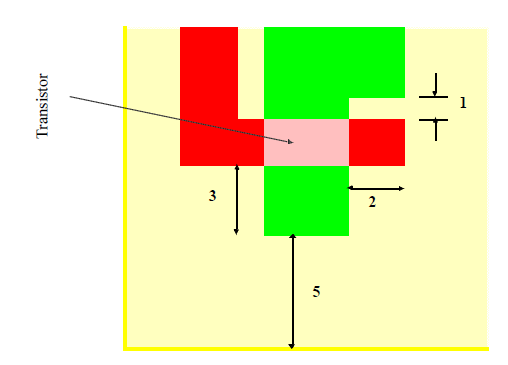
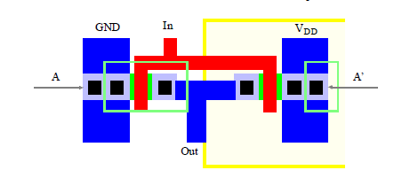

The physical mask layout of any circuit to be manufactured using a particular process must conform to a set of geometric constraints or rules, which are generally called layout design rules. These rules usually specify the minimum allowable line widths for physical objects on-chip such as metal and polysilicon interconnects or diffusion areas, minimum feature dimensions, and minimum allowable separations between two such features. If a metal line width is made too small, for example, it is possible for the line to break during the fabrication process or afterwards, resulting in an open circuit. If two lines are placed too close to each other in the layout, they may form an unwanted short circuit by merging during or after the fabrication process. The main objective of design rules is to achieve a high overall yield and reliability while using the smallest possible silicon area, for any circuit to be manufactured with a particular process.

We can say, in general, that observing the layout design rules significantly increases the probability of fabricating a successful product with high yield.

The design rules are usually described in two ways :

**Micron rules :** 

Micron rules, in which the layout constraints such as minimum feature sizes and minimum allowable feature separations, are stated in terms of absolute dimensions in micrometers, or,

**Lambda rules :** 

Lambda rules, which specify the layout constraints in terms of a single parameter Lambda and, thus, allow linear, proportional scaling of all geometrical constraints.

**SOME DEFINED RULES :**

Description : L-Rule

Minimum active area width : 3 L
Minimum active area spacing : 3 L
Minimum poly width : 2 L
Minimum poly spacing : 2 L
Minimum gate extension of poly over active : 2 L
Minimum poly-active edge spacing : 1 L
(poly outside active area)
Minimum poly-active edge spacing : 3 L
(poly inside active area)
Minimum metal width : 3 L
Minimum metal spacing : 3 L
Poly contact size : 2 L
Minimum poly contact spacing : 2 L
Minimum poly contact to poly edge spacing : 1 L
Minimum poly contact to metal edge spacing : 1 L
Minimum poly contact to active edge spacing : 3 L
Active contact size : 2 L
Minimum active contact spacing : 2 L
(on the same active region)
Minimum active contact to active edge spacing : 1 L
Minimum active contact to metal edge spacing : 1 L
Minimum active contact to poly edge spacing : 3 L
Minimum active contact spacing : 6 L

**Pictorial presentation of Layout Design Rules (DRCs) : Intra Layer Design Rules**

Figure1: Intra Layer Design Rules.

Figure2: Transistor Layout.

Figure3: Vias and Contacts.

Figure4: CMOS Inverter Layout.

